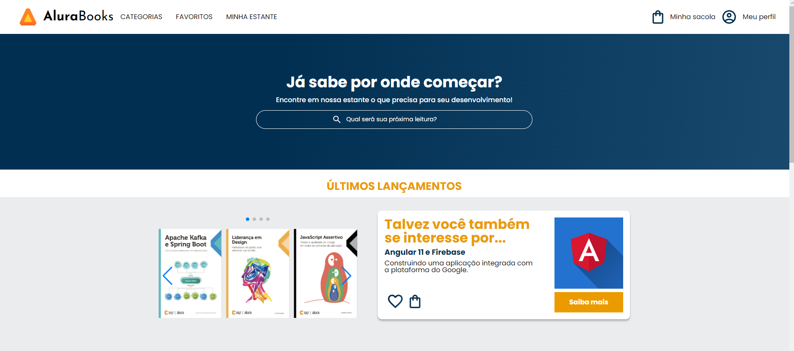

# 

## Descrição do projeto

Página desenvolvida durante o curso de [HTML e CSS](https://cursos.alura.com.br/course/html-css-responsividade-mobile-first) da [Alura](https://www.alura.com.br)

O desafio deste projeto é criar uma página do zero usando a metodologia Mobile-first.
